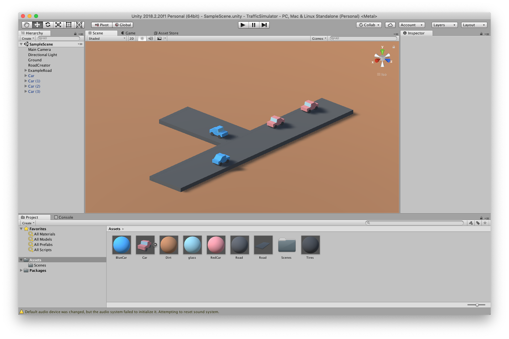

# TrafficSimulator

A simple traffic simulator build with Unity

# TODO

- [x] create intersections square
- [x] create traffic lights (can just hang as a box in the air)
- [x] traffic light controller
- [x] create RoadNetwork controller to hold intersections (verticies) and roads (edges)
- [x] create grid of intersections
- [x] assign random road weights
- [x] find min spanning tree
- [x] add additional roads to create multiple routes to destinations
- [x] procedurally generate road network

- [ ] write a DriveController
- [ ] cars have a ray that points out-front and can sense
- [ ] ray should instruct a car to stop
- [ ] ray should interact with intersection zone (as trigger) and check traffic light condition

- [ ] cars continuously plan route from A to B (randomly select destination)
- [ ] traffic lights reflect state of underlying intersection state
